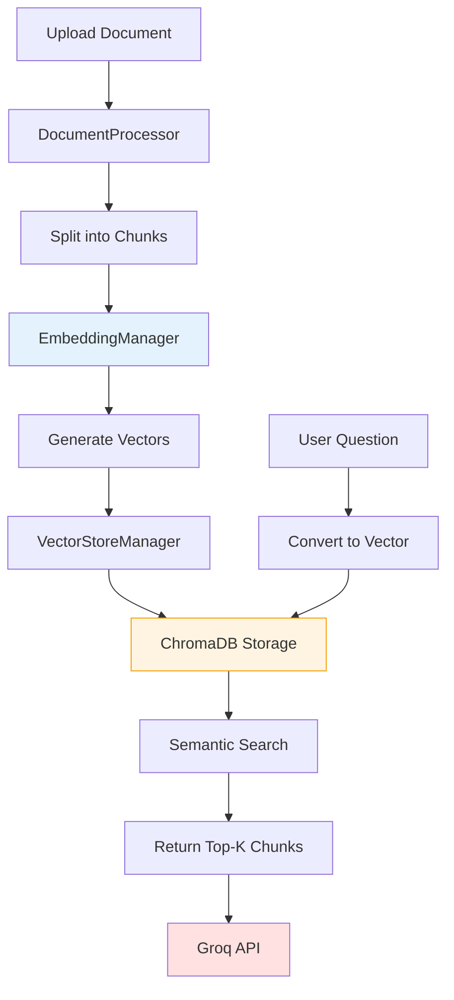

# 🗄️ ChromaDB - Complete Explanation

## 📋 Table of Contents
1. [What is ChromaDB?](#what-is-chromadb)
2. [Why ChromaDB for RAG?](#why-chromadb-for-rag)
3. [How It Works: Vector Search](#how-it-works-vector-search)
4. [Implementation in Your Project](#implementation-in-your-project)
5. [Step-by-Step Flow](#step-by-step-flow)
6. [Data Storage & Persistence](#data-storage--persistence)

---

## 🤖 What is ChromaDB?

**ChromaDB** is an open-source **vector database** designed specifically for AI applications. Think of it as a specialized database that:

- 📊 Stores **embeddings** (numerical representations of text)
- 🔍 Performs **semantic search** (find similar meaning, not just matching words)
- ⚡ Enables **fast similarity search** across thousands of documents
- 💾 Persists data to disk for reuse

### Traditional Database vs Vector Database

| Feature | Traditional DB (SQL) | Vector DB (ChromaDB) |
|---------|---------------------|----------------------|
| **Stores** | Text, numbers, dates | Embeddings (vectors) |
| **Searches by** | Exact match, keywords | Semantic similarity |
| **Example** | "Find ID=123" | "Find similar to: 'machine learning'" |
| **Use case** | User accounts, orders | AI, RAG, recommendations |

### Real-World Analogy

Imagine a library:
- **Traditional DB**: Dewey Decimal System (exact category matching)
- **ChromaDB**: A librarian who understands meaning and finds related books even if keywords don't match

```
Query: "How do I train neural networks?"

Traditional search: Looks for exact words "train", "neural", "networks"
ChromaDB: Finds documents about:
  - "Deep learning optimization"
  - "Backpropagation algorithms"  
  - "Model training best practices"
  
Even though words differ, meaning is similar!
```

---

## 🎯 Why ChromaDB for RAG?

RAG (Retrieval Augmented Generation) has 2 steps:
1. **Retrieval** (ChromaDB's job) ← Find relevant information
2. **Generation** (Groq's job) ← Create answer

ChromaDB is perfect for RAG because:

✅ **Semantic Understanding**: Finds relevant chunks even with different wording  
✅ **Fast**: Searches thousands of chunks in milliseconds  
✅ **Simple**: Easy to set up (no complex infrastructure)  
✅ **Free**: Open-source, runs locally  
✅ **Persistent**: Saves your indexed documents

---

## 🔬 How It Works: Vector Search

### Step 1: Text → Embeddings

When you upload a document:

```
Text chunk: "Python is a programming language used for AI"
           ↓ Embedding Model (sentence-transformers)
Vector: [0.12, -0.45, 0.89, 0.34, ...] (384 numbers)
```

**Embedding** = A list of numbers that captures the **meaning** of text

Similar meanings → Similar vectors

```
"Python is great for AI"     → [0.11, -0.44, 0.91, 0.35, ...]
"JavaScript is for web dev"  → [0.72, 0.15, -0.33, 0.89, ...]
                                 ↑ Very different numbers!
```

### Step 2: Store in ChromaDB

ChromaDB creates an **index** for fast searching:

```
Document Chunks            Embeddings (stored in ChromaDB)
─────────────────────────  ──────────────────────────────
"Chunk 1: Python basics"   [0.12, -0.45, 0.89, ...]
"Chunk 2: AI algorithms"   [0.34, 0.21, -0.67, ...]
"Chunk 3: Web scraping"    [0.56, -0.12, 0.45, ...]
...                        ...
```

### Step 3: Semantic Search

When you ask a question:

```
Question: "How do I use Python for machine learning?"
         ↓ Convert to embedding
Vector: [0.15, -0.42, 0.88, 0.37, ...]
         ↓ ChromaDB compares with all stored vectors
         ↓ Finds most similar (using cosine similarity)
Result: Returns "Chunk 2: AI algorithms" (closest match)
```

**Cosine Similarity**: Mathematical way to measure how "close" two vectors are

```
Similarity score: 0.0 (completely different) → 1.0 (identical)

Question vs Chunk 1: 0.45
Question vs Chunk 2: 0.92 ← Closest! 
Question vs Chunk 3: 0.31
```

---

## 💻 Implementation in Your Project

### Architecture Overview



### Three Key Components

#### 1️⃣ **EmbeddingManager** ([embeddings.py](file:///Users/varunbharadwaj/rag-chatbot-groq/src/embeddings.py))

**Purpose**: Converts text to numerical vectors

```python
class EmbeddingManager:
    def __init__(self, model_name: str = "all-MiniLM-L6-v2"):
        self.model_name = model_name  # Sentence transformer model
        self.embeddings = None
    
    def get_embeddings(self):
        self.embeddings = HuggingFaceEmbeddings(
            model_name=self.model_name,
            model_kwargs={'device': 'cpu'},
            encode_kwargs={'normalize_embeddings': True}
        )
        return self.embeddings
```

**Model Used**: `all-MiniLM-L6-v2`
- 384-dimensional vectors
- Fast (CPU-friendly)
- Good quality for RAG
- Small model size (~80MB)

#### 2️⃣ **VectorStoreManager** ([vector_store.py](file:///Users/varunbharadwaj/rag-chatbot-groq/src/vector_store.py))

**Purpose**: Manages ChromaDB operations

```python
class VectorStoreManager:
    def __init__(self, embeddings, persist_directory: str = "chroma_db"):
        self.embeddings = embeddings
        self.persist_directory = persist_directory
        self.vector_store = None
```

**Key Methods**:

##### Create Vector Store
```python
def create_vector_store(self, documents: List[Document]):
    """Convert documents to embeddings and store in ChromaDB"""
    self.vector_store = Chroma.from_documents(
        documents=documents,              # Text chunks
        embedding=self.embeddings,        # Embedding function
        persist_directory=self.persist_directory  # Save location
    )
```

**What happens internally**:
1. Takes each document chunk
2. Calls embedding model to convert text → vector
3. Stores vector + original text in ChromaDB
4. Creates index for fast search
5. Persists to `chroma_db/` folder

##### Load Existing Store
```python
def load_vector_store(self):
    """Load previously created ChromaDB from disk"""
    if not os.path.exists(self.persist_directory):
        return False
    
    self.vector_store = Chroma(
        persist_directory=self.persist_directory,
        embedding_function=self.embeddings
    )
    return True
```

**Why this matters**: You don't re-process documents every time!

##### Get Retriever
```python
def get_retriever(self, k: int = 4):
    """Create retriever to search for top-K similar chunks"""
    return self.vector_store.as_retriever(
        search_type="similarity",
        search_kwargs={"k": k}
    )
```

**Parameters**:
- `k=4`: Return top 4 most similar chunks
- `search_type="similarity"`: Use cosine similarity

##### Add More Documents
```python
def add_documents(self, documents: List[Document]):
    """Add new chunks to existing ChromaDB"""
    if self.vector_store is None:
        raise ValueError("Vector store not initialized")
    
    self.vector_store.add_documents(documents)
```

##### Search Directly
```python
def similarity_search(self, query: str, k: int = 4):
    """Search for similar documents"""
    return self.vector_store.similarity_search(query, k=k)
```

Returns: List of most similar document chunks

---

## 🔄 Step-by-Step Flow

### Document Upload Flow

```
1. User uploads "machine_learning.pdf"
   ↓
2. DocumentProcessor extracts text
   Text: "Machine learning is a subset of AI that focuses on..."
   ↓
3. Split into chunks (1000 chars, 200 overlap)
   Chunk 1: "Machine learning is a subset of AI..."
   Chunk 2: "...focuses on algorithms that learn from data..."
   Chunk 3: "Neural networks are powerful ML models..."
   ↓
4. EmbeddingManager converts each chunk to vector
   Chunk 1 → [0.12, -0.45, 0.89, 0.34, ...] (384 numbers)
   Chunk 2 → [0.34, 0.21, -0.67, 0.12, ...]
   Chunk 3 → [0.56, -0.12, 0.45, 0.78, ...]
   ↓
5. VectorStoreManager stores in ChromaDB
   Creates index in: /chroma_db/
   ├── chroma.sqlite3       (metadata database)
   ├── index/               (vector index)
   └── ...
   ↓
6. ✅ Document indexed! Ready for questions
```

### Question Answering Flow

```
1. User asks: "What are neural networks?"
   ↓
2. Convert question to embedding vector
   "What are neural networks?" → [0.54, -0.15, 0.43, 0.81, ...]
   ↓
3. ChromaDB searches all stored vectors
   Calculate similarity with each chunk:
   - Chunk 1: similarity = 0.62
   - Chunk 2: similarity = 0.45
   - Chunk 3: similarity = 0.89 ← Highest!
   - Chunk 4: similarity = 0.34
   ...
   ↓
4. Return top 4 chunks (k=4)
   [Chunk 3, Chunk 1, Chunk 7, Chunk 2]
   ↓
5. Send to Groq API as context
   Context: "Neural networks are powerful ML models...
            Machine learning is a subset of AI...
            Deep learning uses multiple layers..."
   Question: "What are neural networks?"
   ↓
6. Groq generates answer based on context
   ↓
7. Display to user with source citations
```

---

## 💾 Data Storage & Persistence

### Directory Structure

When you process a document, ChromaDB creates:

```
rag-chatbot-groq/
└── chroma_db/                  ← ChromaDB storage
    ├── chroma.sqlite3          ← Metadata (document info)
    ├── index/                  ← Vector index files
    │   ├── id_to_uuid_[...].pkl
    │   ├── index_[...].bin
    │   └── index_metadata_[...].pkl
    └── ...
```

### What's Stored?

For each document chunk, ChromaDB stores:

1. **Embedding vector**: The 384-dimensional array
2. **Original text**: The actual chunk content
3. **Metadata**: Source file, chunk ID, etc.

### Persistence Benefits

✅ **No re-processing**: Upload once, query many times  
✅ **Fast startup**: Load existing index instead of rebuilding  
✅ **Memory efficient**: Data stored on disk, loaded as needed  
✅ **Multi-document**: Can accumulate many documents over time

### Size Considerations

**Example**:
- 100-page PDF → ~300 chunks
- Each chunk → 384 numbers (vector) + text
- Total ChromaDB size: ~5-10 MB

Most documents result in very small databases!

---

## 🔧 Configuration Options

### Embedding Model

Change in [embeddings.py:8](file:///Users/varunbharadwaj/rag-chatbot-groq/src/embeddings.py#L8):

```python
model_name = "all-MiniLM-L6-v2"  # Current (fast, good quality)
```

**Alternatives**:

| Model | Dimension | Speed | Quality | Size |
|-------|-----------|-------|---------|------|
| `all-MiniLM-L6-v2` | 384 | ⚡⚡⚡⚡ | ⭐⭐⭐ | 80MB |
| `all-mpnet-base-v2` | 768 | ⚡⚡⚡ | ⭐⭐⭐⭐ | 420MB |
| `multi-qa-MiniLM-L6-cos-v1` | 384 | ⚡⚡⚡⚡ | ⭐⭐⭐⭐ | 80MB |

### Search Parameters

Change in [app.py:71](file:///Users/varunbharadwaj/rag-chatbot-groq/app.py#L71):

```python
retriever = vector_store_manager.get_retriever(k=4)  # Top-K chunks
```

**k parameter**:
- `k=2`: Faster, less context (may miss info)
- `k=4`: Balanced (current setting)
- `k=6`: More context (slower, might add noise)

### Chunk Settings

Change in [document_processor.py:13-14](file:///Users/varunbharadwaj/rag-chatbot-groq/src/document_processor.py#L13-L14):

```python
chunk_size=1000,      # Characters per chunk
chunk_overlap=200     # Overlap between chunks
```

**Impact on ChromaDB**:
- Smaller chunks → More vectors → More precise search
- Larger chunks → Fewer vectors → More context per result

---

## 🎯 Key Insights

### Why Semantic Search is Powerful

**Example queries that work thanks to ChromaDB**:

| Your Question | ChromaDB Finds | Why? |
|---------------|---------------|------|
| "How to start learning ML?" | Chunks about "machine learning basics" | Understands ML = machine learning |
| "Best practices for training" | Chunks about "optimization techniques" | Semantic connection |
| "What causes overfitting?" | Chunks with "model generalization" | Related concepts |

### Performance Characteristics

**Search Speed**:
- 100 chunks: ~10ms
- 1,000 chunks: ~20ms
- 10,000 chunks: ~50ms

**Memory Usage**:
- Minimal (most data on disk)
- Only active index in RAM

**Accuracy**:
- Very high for domain-specific docs
- Works well with technical content
- Handles synonyms and paraphrasing

---

## 📊 ChromaDB vs Other Vector DBs

| Feature | ChromaDB | Pinecone | Weaviate |
|---------|----------|----------|----------|
| **Hosting** | Local/Self-hosted | Cloud only | Both |
| **Cost** | Free | Paid | Free tier |
| **Setup** | pip install | API signup | Docker/Cloud |
| **Best for** | Development, RAG | Production, scale | Semantic search |
| **Your project** | ✅ Perfect fit | Overkill | Could work |

ChromaDB is ideal for your RAG chatbot because:
- ✅ Simple setup (no cloud accounts needed)
- ✅ Free forever
- ✅ Runs locally (privacy)
- ✅ Perfect for personal/development use

---

## 🐛 Common Issues & Solutions

### ChromaDB Not Persisting

**Problem**: Data lost after restart  
**Solution**: Check `persist_directory` is set:
```python
VectorStoreManager(embeddings, persist_directory="chroma_db")
```

### Slow Embedding Generation

**Problem**: First document takes long  
**Solution**: Model download (happens once). Subsequent docs are fast!

### Out of Memory

**Problem**: Large documents crash  
**Solution**: Reduce `chunk_size` or process in batches

---

## ✨ Summary

**ChromaDB in your RAG chatbot**:

1. **Stores** document embeddings (vectors) for semantic search
2. **Enables** finding relevant chunks even with different wording
3. **Powers** the "Retrieval" in RAG (Retrieval Augmented Generation)
4. **Persists** data to disk in `chroma_db/` folder
5. **Searches** using cosine similarity to find top-K matching chunks
6. **Integrates** with sentence-transformers for embedding generation

**The magic flow**:
```
Text → Embeddings → ChromaDB → Semantic Search → Relevant Context → Groq → Answer
```

ChromaDB is the **memory** of your chatbot - storing document knowledge for instant retrieval! 🚀
