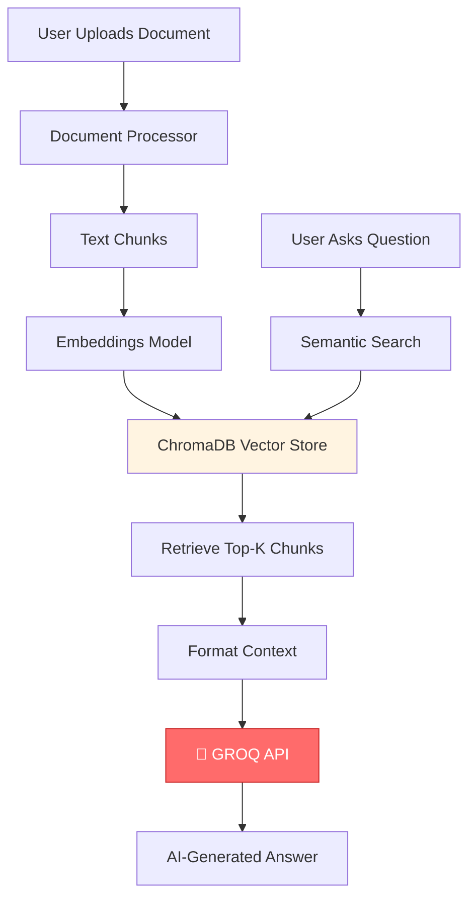

# 🚀 Groq API Integration - Complete Explanation

## 📋 Table of Contents
1. [What is Groq API?](#what-is-groq-api)
2. [How Groq Fits in RAG Pipeline](#how-groq-fits-in-rag-pipeline)
3. [Implementation Breakdown](#implementation-breakdown)
4. [Step-by-Step Execution Flow](#step-by-step-execution-flow)
5. [Configuration & Customization](#configuration--customization)

---

## 🤖 What is Groq API?

**Groq** is a cloud-based API service that provides **ultra-fast Large Language Model (LLM) inference**.

### Key Features:
- ⚡ **Lightning Fast**: 10-100x faster than traditional LLM APIs
- 🧠 **Multiple Models**: llama-3.3-70b-versatile, llama-3.1-8b-instant, gemma2-9b-it
- 💰 **Free Tier**: Generous free usage limits
- 🔧 **API Compatible**: Works with LangChain and OpenAI-style APIs
- 🌐 **Cloud-Based**: No local GPU required

### Why Groq for RAG?
In RAG (Retrieval Augmented Generation), Groq's speed is crucial:
- **Fast context processing**: Quickly analyzes retrieved document chunks
- **Real-time responses**: Users get answers in 1-3 seconds
- **Cost-effective**: Free tier covers most personal/development use

---

## 🏗️ How Groq Fits in RAG Pipeline

### The Complete RAG Flow:



### Groq's Specific Role:

**Input to Groq**:
1. **Context**: Relevant chunks from your document (retrieved from ChromaDB)
2. **Question**: User's query
3. **Prompt Template**: Instructions on how to answer

**Groq Processes**:
- Analyzes the context
- Understands the question
- Generates a coherent, contextual answer

**Output from Groq**:
- Natural language answer based on document context

---

## 💻 Implementation Breakdown

### 1️⃣ **Groq Client Initialization**

Location: [rag_chain.py:38-45](file:///Users/varunbharadwaj/rag-chatbot-groq/src/rag_chain.py#L38-L45)

```python
def initialize_llm(self):
    """Initialize the Groq LLM."""
    self.llm = ChatGroq(
        groq_api_key=self.groq_api_key,    # Your API key
        model_name=self.model_name,         # llama-3.3-70b-versatile
        temperature=0.2,                    # Low = more factual
        max_tokens=1024                     # Max response length
    )
```

**What Each Parameter Does**:
- **`groq_api_key`**: Your authentication key from console.groq.com
- **`model_name`**: Which AI model to use (we use `llama-3.3-70b-versatile`)
- **`temperature`**: Controls creativity (0.0 = factual, 1.0 = creative)
- **`max_tokens`**: Maximum response length (1024 tokens ≈ 750 words)

---

### 2️⃣ **Prompt Template Design**

Location: [rag_chain.py:27-36](file:///Users/varunbharadwaj/rag-chatbot-groq/src/rag_chain.py#L27-L36)

```python
self.prompt_template = \"\"\"Use the following pieces of context to answer the question at the end. 
If you don't know the answer based on the context, just say that you don't know, don't try to make up an answer.
Always provide a detailed and helpful response based on the context.

Context:
{context}

Question: {question}

Helpful Answer:\"\"\"
```

**Why This Matters**:
- **Context placeholder**: `{context}` gets replaced with document chunks
- **Question placeholder**: `{question}` gets replaced with user's query
- **Instructions**: Tells Groq to be honest if it doesn't know
- **Quality control**: Prevents hallucination (making up answers)

---

### 3️⃣ **RAG Chain Construction (LCEL)**

Location: [rag_chain.py:69-78](file:///Users/varunbharadwaj/rag-chatbot-groq/src/rag_chain.py#L69-L78)

This is the **core integration** using LangChain Expression Language (LCEL):

```python
self.qa_chain = (
    {
        "context": retriever | self.format_docs,
        "question": RunnablePassthrough()
    }
    | prompt
    | self.llm          # ← GROQ API CALLED HERE
    | StrOutputParser()
)
```

**Breaking Down Each Step**:

#### Step 1: Prepare Inputs
```python
{
    "context": retriever | self.format_docs,
    "question": RunnablePassthrough()
}
```
- **`retriever`**: Searches ChromaDB for relevant chunks
- **`self.format_docs`**: Combines chunks into one text string
- **`RunnablePassthrough()`**: Passes user question unchanged

#### Step 2: Apply Prompt
```python
| prompt
```
- Inserts context and question into the template
- Creates final prompt sent to Groq

#### Step 3: Call Groq API 🚀
```python
| self.llm
```
- **THIS IS WHERE GROQ API IS CALLED**
- Sends formatted prompt to Groq servers
- Groq's LLM processes it and returns response

#### Step 4: Parse Output
```python
| StrOutputParser()
```
- Converts Groq's response object to plain string
- Makes it easy to display to user

---

### 4️⃣ **Query Execution**

Location: [rag_chain.py:82-104](file:///Users/varunbharadwaj/rag-chatbot-groq/src/rag_chain.py#L82-L104)

```python
def query(self, question: str) -> dict:
    # Get the answer from Groq
    answer = self.qa_chain.invoke(question)
    
    # Get source documents
    source_docs = self.retriever.invoke(question)
    
    return {
        "result": answer,              # Groq's answer
        "source_documents": source_docs # Where it came from
    }
```

**What Happens When You Ask a Question**:
1. `qa_chain.invoke(question)` triggers the entire pipeline
2. ChromaDB retrieves relevant chunks
3. Chunks are formatted and combined with question
4. **Groq API processes the prompt**
5. Answer is returned and displayed

---

## 🔄 Step-by-Step Execution Flow

### When You Upload a Document:

```
1. User uploads PDF/TXT
2. Document → Text extraction
3. Text → Split into chunks (1000 chars each)
4. Chunks → Generate embeddings
5. Embeddings → Store in ChromaDB
   ✅ Document indexed (Groq NOT used here)
```

### When You Ask a Question:

```
1. User types: "What is the document about?"

2. Semantic Search (ChromaDB):
   ├─ Convert question to embedding vector
   ├─ Search vector database for similar chunks
   └─ Return top 4 most relevant chunks

3. Format for Groq:
   ├─ Combine 4 chunks into context string
   ├─ Insert into prompt template
   └─ Create final prompt:
   
   "Use the following pieces of context...
    Context: [Chunk 1] [Chunk 2] [Chunk 3] [Chunk 4]
    Question: What is the document about?
    Helpful Answer:"

4. 🚀 CALL GROQ API:
   ├─ HTTP POST to api.groq.com
   ├─ Send: {model, messages, temperature, max_tokens}
   ├─ Groq processes with llama-3.3-70b-versatile
   └─ Receive: AI-generated answer

5. Display to User:
   ├─ Show answer in chat
   └─ Show source chunks in expandable section
```

---

## ⚙️ Configuration & Customization

### Available Groq Models

You can change the model in [rag_chain.py:12](file:///Users/varunbharadwaj/rag-chatbot-groq/src/rag_chain.py#L12):

| Model | Speed | Quality | Use Case |
|-------|-------|---------|----------|
| `llama-3.3-70b-versatile` | ⚡⚡ | ⭐⭐⭐⭐⭐ | **Best overall** (current) |
| `llama-3.1-8b-instant` | ⚡⚡⚡⚡ | ⭐⭐⭐ | Ultra-fast, simple queries |
| `gemma2-9b-it` | ⚡⚡⚡ | ⭐⭐⭐⭐ | Balanced speed/quality |

### Temperature Settings

Change in [rag_chain.py:43](file:///Users/varunbharadwaj/rag-chatbot-groq/src/rag_chain.py#L43):

```python
temperature=0.2  # Current setting
```

| Value | Behavior | Best For |
|-------|----------|----------|
| `0.0` | Very factual, deterministic | Technical docs, legal |
| `0.2` | Mostly factual (current) | General RAG chatbot |
| `0.5` | Balanced | Creative + factual |
| `1.0` | Very creative | Story writing |

### Max Tokens

Change in [rag_chain.py:44](file:///Users/varunbharadwaj/rag-chatbot-groq/src/rag_chain.py#L44):

```python
max_tokens=1024  # ~750 words
```

**Guidelines**:
- `512` = Short answers (~400 words)
- `1024` = Medium answers (~750 words) - **current**
- `2048` = Long answers (~1500 words)
- `4096` = Very detailed (~3000 words)

---

## 🔐 API Key Management

### Where API Key is Used

1. **Loaded from `.env`**:
   ```bash
   GROQ_API_KEY=gsk_...your_key...
   ```

2. **Passed to Streamlit** ([app.py:95-100](file:///Users/varunbharadwaj/rag-chatbot-groq/app.py#L95-L100)):
   ```python
   groq_api_key = st.text_input(
       "Groq API Key",
       type="password",
       value=os.getenv("GROQ_API_KEY", "")
   )
   ```

3. **Initialized in RAGChain** ([app.py:67](file:///Users/varunbharadwaj/rag-chatbot-groq/app.py#L67)):
   ```python
   vector_store_manager, rag_chain = initialize_components(groq_api_key)
   ```

4. **Used by ChatGroq**:
   ```python
   self.llm = ChatGroq(groq_api_key=self.groq_api_key, ...)
   ```

---

## 💡 Key Insights

### Why Groq Instead of OpenAI/Anthropic?

| Feature | Groq | OpenAI GPT-4 | Anthropic Claude |
|---------|------|--------------|------------------|
| **Speed** | ⚡⚡⚡⚡⚡ | ⚡⚡ | ⚡⚡⚡ |
| **Cost (Free)** | ✅ Generous | ❌ No free tier | ❌ Limited |
| **RAG Suitability** | ✅ Excellent | ✅ Excellent | ✅ Excellent |
| **Setup** | ✅ Simple | ⚠️ Waitlist | ⚠️ API access |

### What Makes This Implementation Good?

1. **LCEL Design**: Modern, composable pipeline
2. **Separation of Concerns**: RAG logic separated from UI
3. **Error Handling**: Validates chain initialization
4. **Source Transparency**: Returns source documents
5. **Configurable**: Easy to change models/settings

---

## 🎯 Common Questions

### Q: Can I use multiple Groq models?
**A**: Yes! Create multiple `RAGChain` instances with different `model_name` parameters.

### Q: How much does Groq cost?
**A**: Free tier includes:
- 30 requests per minute
- 14,400 requests per day
- Good for development and personal use

### Q: What if Groq is down?
**A**: You can swap to OpenAI/Anthropic by changing:
```python
from langchain_groq import ChatGroq  # Current
# to
from langchain_openai import ChatOpenAI
```

### Q: Can I see the raw Groq API call?
**A**: Yes! Add logging:
```python
import logging
logging.basicConfig(level=logging.DEBUG)
```

---

## 📚 Related Documentation

- [Groq Official Docs](https://console.groq.com/docs)
- [LangChain Groq Integration](https://python.langchain.com/docs/integrations/chat/groq)
- [RAG Chain Implementation](file:///Users/varunbharadwaj/rag-chatbot-groq/src/rag_chain.py)

---

## ✨ Summary

**Groq API in your project**:
- Powers the "generation" part of RAG (Retrieval Augmented Generation)
- Receives context from ChromaDB + user question
- Returns intelligent, context-aware answers in 1-3 seconds
- Configured via `ChatGroq` with API key, model, and parameters
- Integrated using LangChain's LCEL for clean, composable code

**The magic happens at**: [rag_chain.py:76](file:///Users/varunbharadwaj/rag-chatbot-groq/src/rag_chain.py#L76) where `| self.llm` calls Groq! 🚀
